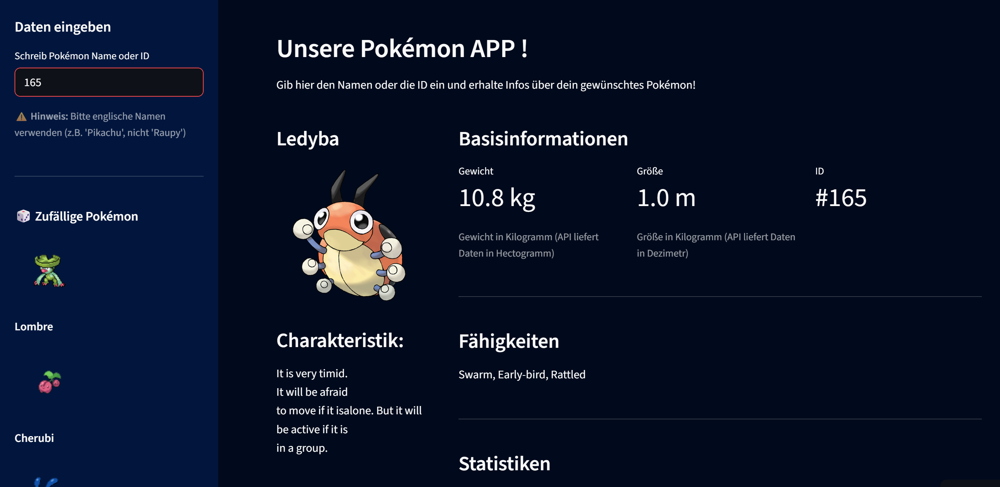

# 🐾 Pokémon-Datenanalyse-App mit Streamlit

[🇩🇪 Deutsch](#-deutsche-version) | [🇬🇧 English](#-english-version)

Eine interaktive Webanwendung, die mithilfe der **PokéAPI** Informationen zu verschiedenen Pokémon abruft und anzeigt.  
Die App wurde mit [Streamlit](https://streamlit.io/) entwickelt und bietet eine einfache, intuitive Oberfläche.  

👉 [🌐 Live-Demo auf Streamlit Cloud](https://pokemon-app-7ddfedcbzgztf6mj9ttgvd.streamlit.app/)

---

## 📸 Vorschau



---

## 🔍 Funktionen

- 🔎 **Pokémon-Suche** nach Name oder ID  
- 📊 **Anzeige von Eigenschaften**: Typ, Gewicht, Größe, Basiswerte und Bild  
- 🎨 **Benutzerfreundliche Oberfläche** mit klarer Struktur  
- ⚡ **Echtzeit-Abfragen** direkt über die API  

---

## ⚙️ Installation & Nutzung

1. Repository klonen:
   ```
   git clone https://github.com/Anna88Mur/pokemon-app.git
   cd pokemon-app
   ```

2. Abhängigkeiten installieren:       
    ```
    pip install -r requirements.txt
    ```

3. Anwendung starten:
    ```
    streamlit run main.py
    ```

## 🇬🇧 English Version

# 🐾 Pokémon Data Analysis App with Streamlit

An interactive web application built with **Streamlit** that fetches and displays information about different Pokémon using the **PokéAPI**.  
The app provides an intuitive interface and real-time data retrieval.  

👉 [🌐 Live Demo on Streamlit Cloud](https://pokemon-app-7ddfedcbzgztf6mj9ttgvd.streamlit.app/)

---

## 📸 Preview


---

## 🔍 Features

- 🔎 **Search Pokémon** by name or ID  
- 📊 **Display attributes**: type, weight, height, base stats, and image  
- 🎨 **User-friendly interface** with a clean design  
- ⚡ **Real-time API queries**  

---

## ⚙️ Installation & Usage

1. Clone the repository:
   ```
   git clone https://github.com/Anna88Mur/pokemon-app.git
   cd pokemon-app
   ```

2. Install dependencies:  
    ```
    pip install -r requirements.txt
    ```

3. Run the app:
    ```
    streamlit run main.py
    ```
